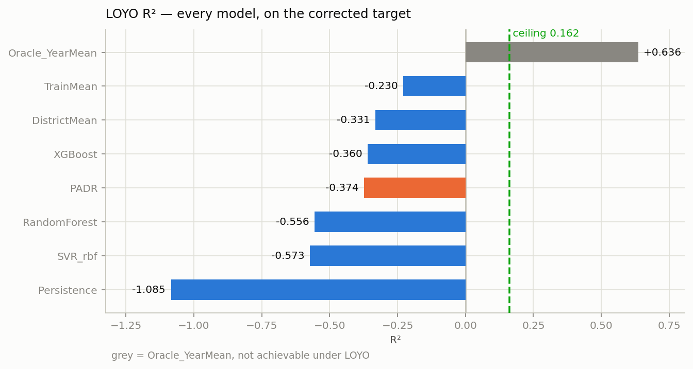
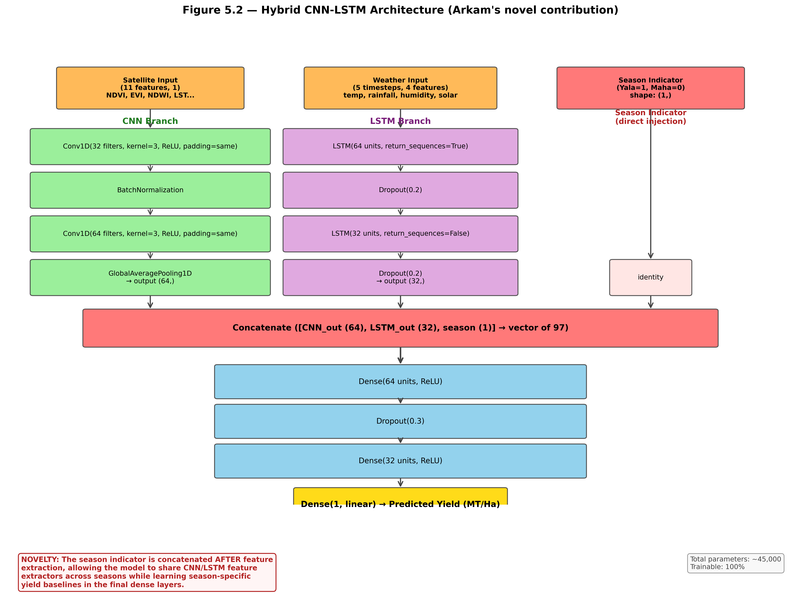

# How to use this guide

This guide is written for **Arkam B.H.M.**, assuming no previous knowledge of Python,
machine learning, deep learning or artificial intelligence.

Do not try to memorise every page in one day.

1. First read Chapters 0, 1, 4, 8, 11 and 18.
2. Practise the 60-second answer aloud.
3. Open the real code while reading Chapters 5 to 16.
4. Run the commands in Chapter 17 at least once before the viva.
5. Use Chapter 21 as the final revision sheet.

The most important rule in this project is:

> **Never mix the synthetic-data results, the 32-feature implementation results and the
> corrected DCS/PADR thesis results.**

The repository contains several experiment paths created at different stages. This guide
labels them clearly.

# Chapter 0 — Emergency viva sheet

## 0.1 Your 60-second project answer

Memorise the meaning, not necessarily every word:

> My component is the machine-learning and deep-learning modelling, evaluation and Flask
> serving API for an AgroAI system that predicts Sri Lankan big-onion yield in metric
> tonnes per hectare. The corrected real dataset contains 28 Yala-season observations:
> four districts over seven years from 2019 to 2025. I used real DCS production and
> harvested-area records to calculate the target, daily NASA POWER weather and MODIS
> vegetation indices as inputs. Because the data is grouped by year, I tested every
> model using Leave-One-Year-Out cross-validation. In each of seven folds, I trained on
> six years, or 24 rows, and tested on the completely unseen year, or four rows. I
> compared simple baselines, Random Forest, XGBoost, SVR, deep models and the
> phenology-aligned PADR model. On the corrected target, no feature-based model beat the
> training-mean baseline. The main reason is that 63.6 percent of yield variation is
> between years, while measurement error explains more than half of the remaining
> within-year variation. Therefore, my main result is an honest negative result and a
> diagnosis of the data limit, not a claim of deployment-ready accuracy.

## 0.2 Numbers to memorise

These are the **corrected DCS/PADR thesis numbers**:

| Item | Number |
|---|---:|
| Real observations | **28** |
| Structure | **4 districts × 7 years × Yala only** |
| Years | **2019–2025** |
| LOYO folds | **7** |
| Rows in each training fold | **24** |
| Rows in each test fold | **4** |
| Target mean | **17.89 MT/ha** |
| Target standard deviation | **6.371 MT/ha** |
| Between-year variance | **63.6%** |
| Between-district variance | **2.2%** |
| Remaining/residual variance | **34.2%** |
| Estimated attainable LOYO R² ceiling | **+0.162** |
| PADR parameters | **17** |
| CNN-LSTM parameters | **44,929** |
| PADR blocked 90% interval half-width | **±15.29 MT/ha** |

Corrected-target model results:

| Model | RMSE | MAE | R² | Meaning |
|---|---:|---:|---:|---|
| Oracle year mean | 3.775 | 3.238 | +0.636 | Cheating reference; not usable |
| **Train mean** | **6.938** | **5.457** | **−0.230** | Best achievable baseline |
| District mean | 7.218 | 5.419 | −0.331 | Historical district average |
| **XGBoost** | **7.296** | **5.456** | **−0.360** | Best corrected feature model |
| PADR | 7.333 | 6.016 | −0.374 | Research model |
| Random Forest | 7.803 | 5.826 | −0.556 | Classical ML |
| SVR | 7.847 | 6.008 | −0.573 | Classical ML |
| Persistence | 9.033 | 7.327 | −1.085 | Previous-year rule |

## 0.3 If the examiner asks “What is your best model?”

Do not answer with one word. Say:

> On the corrected thesis target, the best achievable predictor is the no-feature
> TrainMean baseline at R² −0.230. The best feature-based model is XGBoost at R² −0.360.
> PADR achieves R² −0.374 and is important for scientific interpretation, not because it
> wins on accuracy. A separate 32-feature implementation scoreboard crowns Symbolic
> Regression at R² −0.209, but that path uses a different processed target and must not
> be compared directly with PADR.

This is the most accurate answer for the repository as it exists.

## 0.4 Five definitions you must know

| Term | One-line answer |
|---|---|
| Feature, `X` | An input used to make a prediction, such as rainfall or NDVI. |
| Target, `y` | The value the model learns to predict: onion yield in MT/ha. |
| Training | Fitting model parameters using known inputs and targets. |
| Testing | Measuring predictions on data that was not used for fitting. |
| Overfitting | Memorising training data instead of learning a pattern that works on new data. |

# Chapter 1 — The problem and your part

## 1.1 What the whole project does

The project tries to estimate big-onion harvest yield before the final harvest is known.
The unit is:

```text
MT/ha = metric tonnes of onion produced per hectare of harvested land
```

Example:

```text
Production = 1,000 metric tonnes
Harvested area = 50 hectares
Yield = 1,000 / 50 = 20 MT/ha
```

The intended users are government planners, import planners, agricultural officers and
farmers. If a poor harvest can be detected early, decisions about imports, storage and
planting can be made earlier.

## 1.2 Your individual responsibility

Your component, according to the repository, is:

- the ML/DL modelling pipeline;
- training and evaluation;
- model comparison;
- uncertainty and explainability integration;
- saving trained model artefacts;
- the Flask prediction API.

Your team boundaries are:

| Member | Main responsibility |
|---|---|
| Arkam B.H.M. | Model building, evaluation and Flask API |
| Sharuja B. | Data engineering and feature engineering |
| Shathurya P. | Dashboard, visualisation and explainability user experience |

You should understand the incoming data and outgoing dashboard, but clearly say which code
you personally defend.

## 1.3 Problem type

This is:

- **supervised learning** because historical examples contain both inputs and answers;
- **regression** because the output is a continuous number;
- a **small tabular-data problem** because the final label table has only 28 rows;
- a **temporal generalisation problem** because the goal is to predict a new year.

It is not classification. The model does not output “good” or “bad”; it outputs a number
such as `17.4 MT/ha`.

# Chapter 2 — ML, AI and Python from zero

## 2.1 AI, machine learning and deep learning

Think of three nested boxes:

```text
Artificial Intelligence
└── Machine Learning
    └── Deep Learning
```

- **Artificial intelligence** is the broad goal of making software perform tasks that seem
  intelligent.
- **Machine learning** learns a relationship from examples instead of using only fixed
  `if/else` rules.
- **Deep learning** is machine learning using multi-layer neural networks.

Random Forest, XGBoost and SVR are machine-learning models. LSTM, BiLSTM and CNN are
deep-learning models.

## 2.2 What a model means

A model is a mathematical function:

```text
predicted yield = f(rainfall, temperature, humidity, NDVI, EVI, ...)
```

Suppose the training examples are:

| Rainfall | NDVI | Actual yield |
|---:|---:|---:|
| 600 mm | 0.45 | 11 MT/ha |
| 800 mm | 0.65 | 17 MT/ha |
| 950 mm | 0.72 | 19 MT/ha |

When the model receives rainfall `850` and NDVI `0.68`, it might predict `18 MT/ha`.

The model does not “understand onions” like a human. It adjusts mathematical parameters to
reduce prediction error.

## 2.3 Training in one simple loop

Conceptually:

```python
for training_step in many_steps:
    prediction = model(inputs)
    error = actual_yield - prediction
    update_model_to_reduce(error)
```

Scikit-learn hides that loop behind:

```python
model.fit(X_train, y_train)
predictions = model.predict(X_test)
```

Keras deep-learning code uses:

```python
model.fit(X_train, y_train, epochs=50)
predictions = model.predict(X_test)
```

## 2.4 Essential Python vocabulary

```python
rainfall = 800                 # variable
districts = ["Matale", "Anuradhapura"]  # list
settings = {"max_depth": 4}    # dictionary
```

A function is a reusable block:

```python
def calculate_yield(production, extent):
    return production / extent
```

Calling it:

```python
value = calculate_yield(1000, 50)
# value is 20
```

Important project libraries:

| Library | Purpose |
|---|---|
| `pandas` | Read CSV files and work with tables/DataFrames |
| `numpy` | Arrays and numerical calculations |
| `scikit-learn` | ML models, scaling and metrics |
| `xgboost` | Gradient-boosted tree model |
| `tensorflow.keras` | Neural networks |
| `scipy` | Optimisation used by PADR and stacking |
| `joblib` | Save and load scikit-learn models |
| `flask` | Serve predictions through a web API |
| `shap` | Explain model predictions |

## 2.5 The shapes you will see

In the 32-feature implementation:

```text
X shape = (28, 32)
y shape = (28,)
```

This means:

- 28 rows or observations;
- 32 input features for each observation;
- one target value for each observation.

For a weather sequence:

```text
weather_seq shape = (28, 5, 4)
```

This means:

- 28 observations;
- 5 time steps;
- 4 weather variables at each step.

# Chapter 3 — Data and inputs

## 3.1 The authoritative corrected target

The corrected thesis path starts from:

```text
data/collected/FYP data(manual) - real all datas.csv
```

It contains 87 real DCS monthly records with harvested extent and production.

`src/dcs_panel.py`:

1. reads numeric values with thousands separators correctly;
2. standardises district names;
3. identifies physically impossible monthly records;
4. excludes those records when configured;
5. groups by district, year and season;
6. calculates seasonal yield.

The target formula is:

```text
yield(district, year)
    = sum(monthly production in MT)
      / sum(monthly harvested extent in hectares)
```

It is **not** the simple average of monthly yield values. Area weighting is the standard
agronomic calculation.

## 3.2 Final corrected sample

```text
Districts: Anuradhapura, Kurunegala, Matale, Polonnaruwa
Years:     2019, 2020, 2021, 2022, 2023, 2024, 2025
Season:    Yala only
Rows:      4 × 7 × 1 = 28
```

One row means “one district in one year”.

Example:

```text
Year=2023, District=Matale, Season=Yala,
weather summaries..., NDVI summaries...,
actual yield=18.6 MT/ha
```

## 3.3 Real covariate sources

| Source | What it contributes |
|---|---|
| DCS | Actual production, extent and target yield |
| NASA POWER | Daily temperature, rainfall, humidity and solar radiation |
| MODIS | 16-day NDVI and EVI vegetation-index composites |
| Soil/source table | Soil pH, clay and sand for the implementation pipeline |

The corrected `features_real.py` path uses 37,988 daily weather rows and MODIS composites,
then reduces them to 22 non-constant predictors at the district-year level.

## 3.4 Corrected 22-feature model input

The features recorded in `baseline_oof.json` are:

| Group | Features |
|---|---|
| Weather | season average temperature, total rainfall, average humidity, solar radiation, growing-degree days, heat-stress days, temperature range, maximum daily rainfall, rain days, longest dry spell, maximum 7-day rainfall |
| Satellite | mean/max/min NDVI, NDVI standard deviation, time to peak NDVI, NDVI growth rate, mean EVI |
| Anomalies | rainfall SPI and NDVI anomaly, calculated against 2000–2018 climatology |
| Interactions | rainfall × NDVI, temperature × humidity |

The model receives numbers, not raw satellite images. For example, many MODIS values are
summarised into one seasonal mean NDVI.

## 3.5 The 32 inputs in the main ML/DL implementation

`src/config.py` defines a canonical list called `ALL_FEATURES`.

### Weather features: 9

| # | Code name | Simple meaning |
|---:|---|---|
| 1 | `season_avg_temp` | Average growing-season air temperature |
| 2 | `season_total_rainfall` | Total rainfall during the season |
| 3 | `season_avg_humidity` | Average relative humidity |
| 4 | `season_avg_solar_rad` | Average solar radiation |
| 5 | `growing_degree_days` | Accumulated useful heat for crop growth |
| 6 | `heat_stress_days` | Number of days above a heat threshold |
| 7 | `drought_index_spi` | Standardised measure of unusually dry/wet conditions |
| 8 | `temp_range` | Difference/range between high and low temperatures |
| 9 | `max_daily_rainfall` | Largest one-day rainfall |

### Satellite features: 11

| # | Code name | Simple meaning |
|---:|---|---|
| 10 | `season_mean_ndvi` | Average vegetation greenness |
| 11 | `season_max_ndvi` | Maximum greenness |
| 12 | `season_min_ndvi` | Minimum greenness |
| 13 | `ndvi_std` | How much greenness varies |
| 14 | `ndvi_anomaly` | Difference from normal greenness |
| 15 | `time_to_peak_ndvi` | Time until the greenest point |
| 16 | `ndvi_growth_rate` | Rate of greenness increase/decrease |
| 17 | `season_mean_evi` | Enhanced vegetation index |
| 18 | `season_mean_ndwi` | Vegetation/water-content index |
| 19 | `season_mean_lst_day` | Average daytime land-surface temperature |
| 20 | `season_mean_lst_night` | Average night-time land-surface temperature |

### Historical features: 5

| # | Code name | Simple meaning |
|---:|---|---|
| 21 | `prev_season_yield` | Previous season’s target yield |
| 22 | `prev_year_yield` | Previous year’s target yield |
| 23 | `yield_3yr_avg` | Previous three-year average yield |
| 24 | `season_indicator` | Yala=1, Maha=0 |
| 25 | `extent_prev_season` | Previous season’s cultivated/harvested area |

### Soil features: 4

| # | Code name | Simple meaning |
|---:|---|---|
| 26 | `soil_ph` | Soil acidity/alkalinity |
| 27 | `organic_carbon` | Organic carbon content |
| 28 | `clay_pct` | Percentage clay |
| 29 | `sand_pct` | Percentage sand |

### Interaction features: 3

| # | Code name | Formula |
|---:|---|---|
| 30 | `rainfall_x_ndvi` | rainfall × mean NDVI |
| 31 | `temp_x_humidity` | temperature × humidity |
| 32 | `ndvi_x_lst` | NDVI × daytime land-surface temperature |

An interaction lets the model see a combination directly. For example, the effect of high
temperature may be different when humidity is high.

## 3.6 Important feature warnings

In the current `main.py --real` implementation:

- six features are constant and therefore contain no predictive information;
- yield lag features can leak held-out-year targets under LOYO;
- `ndvi_anomaly` and `drought_index_spi` use full-panel statistics in that path;
- the LSTM weather sequence is manufactured from seasonal averages;
- every real row is Yala, so `season_indicator` is always 1;
- district-average NDVI is not crop-specific because onion occupies a tiny fraction of a
  district.

The corrected `features_real.py` path fixes the anomaly reference period and drops target
lag features.

## 3.7 Observation weights

Some district-year targets come from a very small harvested area and others from a large
area. A target based on four hectares is usually less reliable than one based on 1,765
hectares.

The corrected path uses:

```text
weight = square root of harvested extent
```

Square-root weighting is a compromise. Direct area weighting spans about 440 times and
would make the smallest district almost irrelevant.

# Chapter 4 — The project’s different pipelines

This chapter prevents the most dangerous viva mistake.

## 4.1 Pipeline A — Synthetic software demo

Command:

```bash
python main.py
```

Facts:

- 136 computer-generated rows;
- four districts including Jaffna;
- Yala and Maha;
- outputs go to `outputs/results/` and `outputs/models/`;
- positive R² around 0.85 is possible because the data was generated from a known formula.

Correct viva sentence:

> Synthetic data was used to test the end-to-end software and dashboard. It is not
> scientific evidence and I do not report its accuracy as a real result.

## 4.2 Pipeline B — 32-feature implementation path

Command:

```bash
DATA_VARIANT=real python main.py --real
```

Flow:

```text
onion_unique_per_key.csv
→ filter rows marked real
→ monthly-to-seasonal aggregation
→ preprocessing and target clipping
→ 32 features
→ ML, DL, symbolic, physics-residual and stacking
→ outputs/results_real/model_comparison.csv
```

This is the full software pipeline used to demonstrate every model family and the API.
Its top saved model is Symbolic Regression:

```text
R² = -0.209
RMSE = 6.7165 MT/ha
```

However, this path still has known leakage/proxy issues and its processed target differs
from the corrected DCS target.

## 4.3 Pipeline C — Corrected thesis/PADR path

Commands:

```bash
python src/dcs_panel.py
python src/baselines.py
python src/run_padr.py
python src/variance_decomposition.py
python src/ablation_padr.py
python src/conformal_blocked.py
```

Flow:

```text
87 genuine DCS production/extent records
        +
daily NASA POWER weather
        +
real MODIS NDVI/EVI
        ↓
corrected 28-row district-year panel
        ↓
22 non-constant, leak-reduced features
        ↓
LOYO baselines + RF + XGBoost + SVR + PADR
        ↓
variance, power, ablation and blocked uncertainty analyses
```

This is the path defended by the final report’s corrected model-comparison table.

## 4.4 Why outputs must not be joined blindly

The saved OOF files reveal two different target distributions:

| Output family | Target mean | Target SD |
|---|---:|---:|
| Main 32-feature OOF files | about 17.58 | about 6.22 |
| Corrected PADR OOF file | about 17.89 | about 6.37 |

Even if both have 28 rows and the same district/year keys, they are not the same `y`.
Therefore, a combined table that places Symbolic Regression and PADR together should not
be presented as a perfectly controlled comparison.

Safe viva rule:

> Use the corrected Table 7.5 numbers when defending research conclusions. Use the
> 32-feature table only when explaining the broader implemented model roster and API.

# Chapter 5 — End-to-end execution, step by step

## 5.1 Entry point: `main.py`

`main.py` is the orchestrator. An orchestrator does not contain every algorithm; it calls
the modules in the correct order.

Simplified version:

```python
df = load_data()[0]
df = preprocess(df)
X, y, feature_names, seq_payload = engineer_features(df)

run_eda(df)
train_all_ml_models(X, y, feature_names, df)
train_symbolic_regression(X, y, feature_names, df)
train_physics_residual(X, y, feature_names, df)
train_all_dl_models(seq_payload, df)
run_ablation_study(df)
run_shap_analysis(X, feature_names)
run_stacking()
generate_final_comparison()
compute_conformal()
```

Each call creates an output that later calls can use.

## 5.2 Step 1 — Configuration

File: `src/config.py`

It stores:

- random seed;
- input/output paths;
- data variant;
- feature lists;
- model hyperparameter grids;
- neural-network settings;
- thresholds and agronomic constants.

Why central configuration is useful:

> It prevents different files from silently using different feature orders, random seeds
> or output directories.

Important code:

```python
RANDOM_STATE = 42
DATA_VARIANT = os.environ.get("DATA_VARIANT", "synthetic")
TARGET_COLUMN = "Avg_Yield_MT_per_Ha"
```

Seed 42 makes random operations reproducible. Reproducible means another run should give
the same result, subject to small platform-specific neural-network differences.

## 5.3 Step 2 — Load data

File: `src/data_loader.py`

Entry function:

```python
def load_data():
    if DATA_VARIANT == "real":
        return load_collected_data(), "real"
    ...
    return generate_synthetic_data(), "synthetic"
```

`load_collected_data()`:

1. reads the monthly CSV using `pandas`;
2. cleans district, season and month text;
3. removes rows where `source != "real"`;
4. groups by year, district and season;
5. calculates seasonal summaries;
6. derives missing canonical features;
7. returns a 28-row table.

`pandas` example:

```python
raw = pd.read_csv(COLLECTED_FILE)
raw = raw[raw["source"] == "real"].copy()
```

The `.copy()` creates an independent table and avoids accidental chained updates.

## 5.4 Step 3 — Preprocess

File: `src/preprocessor.py`

It:

- verifies required columns;
- drops rows with missing targets;
- removes zero/negative targets;
- checks valid districts and seasons;
- fills missing numeric inputs with medians;
- clips the lowest/highest one percent of target values;
- saves `integrated_dataset.csv`.

Key code:

```python
required_keys = {"Year", "Season", "District", TARGET_COLUMN}
df = df.dropna(subset=[TARGET_COLUMN]).copy()
df = df[df[TARGET_COLUMN] > 0]
```

A set is used because order does not matter when checking whether required names exist.

Important viva honesty:

> The current main preprocessor computes medians and clipping thresholds on the whole
> table before LOYO. A stricter design would fit every data-dependent transformation
> using only the training fold. The corrected thesis path avoids the most important
> leakage sources and uses explicit physical plausibility checks.

## 5.5 Step 4 — Engineer features

File: `src/feature_engineer.py`

The function returns:

```python
return X_tabular, y, feature_names, seq_payload
```

Meaning:

- `X_tabular`: 2D input matrix for RF, XGBoost, SVR and symbolic models;
- `y`: one-dimensional target vector;
- `feature_names`: names in exactly the same order as columns in `X`;
- `seq_payload`: tensors for LSTM, CNN and hybrid models.

Code:

```python
X_tabular = df[feat_cols].astype(np.float32).values
y = df[TARGET_COLUMN].astype(np.float32).values
```

`float32` reduces memory and matches TensorFlow’s normal numeric type.

## 5.6 Step 5 — Exploratory data analysis

File: `src/eda.py`

EDA means examining data before interpreting models. It creates:

- target distribution;
- yield by year;
- yield by district;
- correlation heatmap;
- feature plots.

EDA does not train a predictive model. It helps find errors, outliers and patterns.

## 5.7 Step 6 — Train classical ML models

File: `src/ml_models.py`

Three models are trained:

```text
Random Forest
XGBoost
Support Vector Regression
```

Each model:

1. selects hyperparameters;
2. creates LOYO out-of-fold predictions;
3. calculates metrics;
4. refits on all 28 rows for serving;
5. saves the final artefact;
6. saves plots and OOF JSON.

## 5.8 Step 7 — Train other models

- `src/symbolic.py`: human-readable equation search;
- `src/physics_residual.py`: physical backbone plus residual RF;
- `src/dl_models.py`: LSTM, BiLSTM, CNN, CNN-LSTM;
- `src/padr.py`: differentiable agronomic response model;
- `src/stacking.py`: combine predictions.

## 5.9 Step 8 — Evaluate and explain

- `src/ablation.py`: remove feature groups and observe the score change;
- `src/explainer.py`: SHAP feature contributions;
- `src/evaluator.py`: collect OOF files and rank models;
- `src/conformal.py`: uncertainty interval for the implementation path;
- `src/conformal_blocked.py`: year-blocked uncertainty for the corrected path.

## 5.10 Step 9 — Save and serve

Model files:

```text
outputs/models_real/rf_best.pkl
outputs/models_real/xgb_best.pkl
outputs/models_real/svr_best.pkl
outputs/models_real/svr_scaler.pkl
outputs/models_real/*.keras
```

Result files:

```text
outputs/results_real/model_comparison.csv
outputs/results_real/oof_*.json
outputs/results_real/feature_importance.json
outputs/results_real/conformal.json
```

The API loads a saved, servable tabular model rather than retraining on every request.

# Chapter 6 — Preprocessing and feature engineering in detail

## 6.1 Why cleaning is necessary

Raw data can contain:

- text where a number is expected;
- missing values;
- different spellings of one district;
- impossible yields;
- mixed monthly and seasonal time scales;
- duplicated or synthetic records.

A powerful model cannot repair a wrong target. Data validity comes before model choice.

## 6.2 Thousands-separator problem

A value such as:

```text
"3,091"
```

must become numeric `3091`, not missing text.

Correct loading:

```python
pd.read_csv(path, thousands=",")
```

This bug previously produced an implausible target for Matale 2020.

## 6.3 Zero versus missing

Zero can mean:

- a true zero harvest; or
- “no measurement”, depending on the source column.

The code must use domain knowledge. Replacing every zero with missing would remove genuine
no-harvest records. Keeping every zero could treat absent soil/NDVI data as physical zero.

## 6.4 Impossible-record filter

The corrected DCS code flags monthly implied yields above `60 MT/ha`.

Why:

> A reported value such as 442 MT/ha is more likely a transcription/unit problem than a
> real Sri Lankan onion harvest.

The records are logged in:

```text
outputs/results_real/data_quality_report.csv
```

They are excluded rather than secretly corrected.

## 6.5 Aggregation

Daily weather becomes seasonal features:

```python
season_avg_temp = tmean.mean()
season_total_rainfall = rain.sum()
heat_stress_days = (tmax > 32).sum()
max_daily_rainfall = rain.max()
```

Many daily records are reduced to one district-year row because the target exists only at
district-year level.

## 6.6 Growing-degree days

Growing-degree days approximate accumulated crop-development heat.

Simple daily formula:

```text
GDD_day = max(mean temperature − base temperature, 0)
GDD_season = sum(GDD_day)
```

With base temperature 10°C:

```text
Mean temperature = 27°C
Daily GDD = 27 − 10 = 17 degree-days
```

## 6.7 SPI and NDVI anomaly

An anomaly means “different from normal”.

```text
z-score = (current value − historical mean) / historical standard deviation
```

The corrected path uses the **2000–2018 pre-sample climatology**. No LOYO test year is in
that reference period, so held-out data does not influence the transformation.

## 6.8 Scaling

Rainfall may be `900`, while NDVI may be `0.6`. SVR and neural networks are sensitive to
different numeric scales.

Standard scaling:

```text
scaled value = (value − training mean) / training standard deviation
```

Correct fold logic:

```python
scaler = StandardScaler().fit(X_train)
X_train_scaled = scaler.transform(X_train)
X_test_scaled = scaler.transform(X_test)
```

Never fit the scaler using `X_test`.

Tree models do not normally need scaling because they make threshold splits.

## 6.9 Missing-value imputation

Median fill example:

```text
values = [5.8, 6.1, missing, 6.4]
median = 6.1
missing becomes 6.1
```

The median is less affected by outliers than the mean. For strict validation it must be
calculated from the training fold only.

## 6.10 Manufactured weather sequence warning

The main deep-learning path calls:

```python
_synthesise_weather_sequence(row, rng)
```

It expands seasonal averages into five steps using:

- a fixed sine-shaped temperature curve;
- fixed rainfall weights;
- constant humidity/solar values;
- small random noise.

Therefore:

> The LSTM does not receive a genuinely observed five-month series in this path. It
> receives a deterministic expansion of seasonal summaries. The DL results cannot be
> used to prove that the network learned real monthly temporal behaviour.

# Chapter 7 — Training, validation and testing

## 7.1 Three different purposes

| Split | Purpose |
|---|---|
| Training data | Fit model parameters |
| Validation data | Choose settings or stop DL training |
| Test data | Final unbiased measurement on unseen data |

The same row must not influence both fitting and final testing.

## 7.2 Why a random 80/20 split is wrong here

Rows in one year share national conditions such as:

- monsoon behaviour;
- policy and input availability;
- pests;
- fertiliser;
- economic disruptions.

If 2022 rows appear in both train and test sets, the model partially sees the same year it
is asked to predict.

An audit found a random split could report R² `0.552` while honest year-based evaluation
was near zero. That is why validation design matters more than choosing a fancy model.

## 7.3 Leave-One-Year-Out cross-validation



Algorithm:

```python
for held_year in [2019, 2020, 2021, 2022, 2023, 2024, 2025]:
    train = all rows where Year != held_year
    test = all rows where Year == held_year

    model = new_model()
    model.fit(X[train], y[train])
    oof_prediction[test] = model.predict(X[test])
```

Fold example:

```text
Held-out year: 2022
Training: all four districts from 2019–2021 and 2023–2025 = 24 rows
Testing: all four districts from 2022 = 4 rows
```

The model is rebuilt from scratch seven times.

## 7.4 OOF predictions

OOF means **out of fold**.

After all folds:

- every row has one prediction;
- that prediction came from a model that did not train on that row’s year;
- the 28 predictions are pooled;
- RMSE, MAE and R² are calculated once.

Example output:

```json
{
  "Year": 2020,
  "District": "Anuradhapura",
  "actual": 11.19,
  "predicted": 20.21
}
```

## 7.5 Hyperparameters

A parameter is learned by the model. A hyperparameter is chosen before fitting.

Examples:

| Model | Parameter learned | Hyperparameter selected |
|---|---|---|
| Random Forest | tree split values | number/depth of trees |
| XGBoost | tree structures and leaf values | learning rate, depth |
| SVR | support-vector coefficients | `C`, `gamma`, `epsilon` |
| Neural network | weights and biases | layers, units, learning rate |

The main ML code uses `GridSearchCV` with `TimeSeriesSplit` to select settings.

## 7.6 Nested evaluation idea

The correct conceptual structure is:

```text
Outer LOYO:
    protects the final held-out year

Inner time-based split:
    chooses hyperparameters using only outer-training data
```

The held-out outer year must never be used to choose settings.

The current `ml_models.py` performs one full-data grid search before LOYO and then applies
the chosen settings in each fold. Explain this as the implemented behaviour, and say a
fully nested search would be the stricter improvement.

## 7.7 Final refit versus test score

After evaluation, the code fits one final model on all 28 rows:

```python
final.fit(X, y)
joblib.dump(final, "rf_best.pkl")
```

Why:

- LOYO models are temporary evaluation models;
- the saved serving model should use all available historical information.

Its reported performance must still be the OOF performance, not its training score.

## 7.8 Early stopping in deep learning

Neural networks can overfit quickly.

```python
EarlyStopping(
    monitor="val_loss",
    patience=20,
    restore_best_weights=True
)
```

Meaning:

- watch validation loss;
- if it does not improve for 20 epochs, stop;
- restore the weights from the best epoch.

`ReduceLROnPlateau` also decreases the learning rate when improvement stops.

# Chapter 8 — Every model explained simply

## 8.1 Baselines first

A baseline is a simple rule that a real model must beat.

### TrainMean

```text
Predict the average target in the six training years.
```

Uses no weather, satellite or soil features.

### DistrictMean

```text
Predict the historical training average for that district.
```

### Persistence

```text
Predict the previous year’s yield.
```

### Oracle YearMean

```text
Predict the actual mean of the held-out year.
```

This cheats and is not deployable. It measures the value of perfect knowledge of the year
effect.

## 8.2 Random Forest

Simple picture:

> Build many decision trees from random subsets of rows and features, then average their
> predictions.

One tree might ask:

```text
Is GDD > 2,900?
├── yes: Is EVI > 0.45? → predict 20
└── no:  Is rainfall > 900? → predict 14
```

Project code:

```python
RandomForestRegressor(
    n_estimators=500,
    max_depth=4,
    min_samples_leaf=3,
    random_state=42
)
```

Strengths:

- works well on tabular data;
- captures nonlinear relationships;
- does not require scaling;
- averages trees to reduce variance.

Weaknesses:

- can still overfit 24 training rows;
- cannot extrapolate well beyond training targets;
- feature importance does not prove causality.

Corrected result: `R² −0.556`, `RMSE 7.803`.

## 8.3 XGBoost

Simple picture:

> Build trees one after another. Each new tree focuses on correcting errors made by
> previous trees.

This is gradient boosting.

Corrected model:

```python
XGBRegressor(
    n_estimators=300,
    learning_rate=0.03,
    max_depth=2,
    subsample=0.8,
    colsample_bytree=0.8,
    reg_lambda=2.0,
    random_state=42
)
```

Why shallow depth:

> With only 24 training rows per fold, deep trees would memorise noise.

The main implementation also sets monotonic constraints so predicted yield cannot decrease
when selected greenness features increase.

Strengths:

- often strong on small/medium tabular data;
- learns nonlinearities and interactions;
- regularisation can control overfitting.

Weaknesses:

- sensitive to hyperparameters;
- can still overfit extremely small samples;
- an enforced monotonic relationship may be too simple if NDVI is not onion-specific.

Corrected result: `R² −0.360`, `RMSE 7.296`. It is the best corrected feature model.

## 8.4 Support Vector Regression

Simple picture:

> Fit the flattest possible tube through the data. Errors inside an epsilon-wide tube
> are ignored; points at the boundary become support vectors.

Important settings:

- `kernel="rbf"` allows a curved nonlinear relationship;
- `C` controls the penalty for errors;
- `gamma` controls how local the curve is;
- `epsilon` controls tube width.

It needs scaled inputs:

```python
scaler = StandardScaler().fit(X_train)
model = SVR(kernel="rbf", C=10, epsilon=0.5)
model.fit(scaler.transform(X_train), y_train)
```

Corrected result: `R² −0.573`, `RMSE 7.847`.

The API serves SVR in the current main-output state because the overall crowned Symbolic
Regression model is not in the API’s servable-model list and SVR is the best saved model in
that list.

## 8.5 LSTM

LSTM means **Long Short-Term Memory**.

It reads a sequence step by step while maintaining an internal memory. It is useful when
the order of observations matters.

Project architecture:

```text
weather input (5 time steps × 4 variables)
→ LSTM 64 units, return sequences
→ Dropout 0.2
→ LSTM 32 units
→ Dropout 0.2
→ Dense 16, ReLU
→ Dense 1, linear yield
```

Why final activation is linear:

> Regression output can be any continuous number. Softmax is for classification.

Parameters: `30,625`.

Main-path result: `R² −2.081`, `RMSE 10.722`.

## 8.6 BiLSTM

BiLSTM reads the same sequence:

- forwards;
- backwards;
- then combines both representations.

Parameters: `77,601`.

Main-path saved result: `R² −0.454`, `RMSE 7.366`.

It has more parameters than LSTM and therefore a higher overfitting risk.

## 8.7 1D CNN

A 1D convolution slides a small filter along an ordered input and detects local patterns.

Architecture:

```text
input
→ Conv1D(32)
→ Batch normalisation
→ Max pooling
→ Conv1D(64)
→ Global average pooling
→ Dense 32
→ Dropout
→ output
```

Parameters: `8,577`.

Main-path result: `R² −3.944`, `RMSE 13.582`.

Important limitation:

> A CNN assumes neighbouring positions have meaningful local structure. Adjacent tabular
> feature order may not have the same natural geometry as pixels or time.

## 8.8 Hybrid CNN-LSTM

The hybrid has three inputs:

```text
Satellite branch → CNN ┐
Weather branch   → LSTM├→ concatenate → dense layers → yield
Season indicator ──────┘
```



Purpose:

- CNN extracts satellite-feature patterns;
- LSTM extracts weather-sequence patterns;
- season indicator lets the model behave differently in Yala and Maha.

Parameters: `44,929`.

Main-path result: `R² −3.635`, `RMSE 13.151`.

Why it failed:

- only 24 training rows per fold;
- 44,929 trainable parameters;
- all real rows are Yala, so season indicator is constant;
- the five-step weather sequence is manufactured, not observed;
- the district-level satellite signal is not onion-specific.

Strong viva answer:

> The hybrid architecture is implemented correctly as a multimodal network, but the
> available real panel cannot identify it. Its failure is evidence that architectural
> complexity cannot replace independent labels.

## 8.9 Symbolic Regression

Symbolic Regression searches for an equation instead of fitting a black box.

Allowed operations:

```text
addition, subtraction, multiplication and square root
```

The search uses genetic programming:

1. create many random equations;
2. score them;
3. keep better ones;
4. mutate/cross equations;
5. penalise unnecessary complexity;
6. repeat for 20 generations.

The main path selects at most five features and saves:

```text
outputs/results_real/symbolic_equation.txt
```

Main-path result: `R² −0.209`, `RMSE 6.7165`.

Important interpretation:

> It is the highest row in the main implementation table, but negative R² still means
> poor predictive skill. The equation is useful for transparency, not proof of a causal
> agronomic law.

## 8.10 Physics-residual hybrid

Two stages:

```text
Stage 1: fixed agronomic suitability backbone
Stage 2: Random Forest predicts the remaining residual error
Final prediction = backbone prediction + predicted residual
```

The backbone combines:

- growing-degree-day response;
- water stress from SPI and FAO-33 `Ky`;
- heat-stress loss.

Code concept:

```python
base = a + b * mechanistic_index(X)
residual_model.fit(X, y - base)
prediction = base + residual_model.predict(X)
```

This is different from PADR. Physics-residual freezes the mechanistic constants and learns
an ML correction. PADR learns bounded agronomic constants directly.

## 8.11 Stacking

Stacking combines predictions from other models.

Three combiners:

| Combiner | Rule |
|---|---|
| `StackMean` | Equal average |
| `StackInvRMSE` | Better models receive larger inverse-error weights |
| `StackConvex` | Learn non-negative weights that sum to one |

Weights must be fitted using only training years inside each outer fold.

Main-path result:

```text
StackConvex R² = −0.417
StackMean   R² = −0.584
```

The learned blend beats the equal average here, so the forecast-combination puzzle does not
hold in that saved experiment.

## 8.12 PADR

PADR means **Phenology-Aligned Differentiable Response**.

It is explained fully in Chapter 12.

Short answer:

> PADR is a 17-parameter bounded agronomic response model. It aligns daily weather by
> thermal crop-development time, calculates thermal, water-deficit and waterlogging
> stress, learns when the crop is most sensitive, and maps the integrated stress to
> yield.

Corrected result: `R² −0.374`, `RMSE 7.333`.

# Chapter 9 — Deep-learning code explained

## 9.1 Inputs and outputs

Keras model definition:

```python
inputs = layers.Input(shape=(5, 4), name="weather_seq")
...
out = layers.Dense(1, activation="linear")(x)
model = models.Model(inputs, out)
```

`shape=(5, 4)` means five time steps and four variables per step.

`Dense(1)` means one numeric yield prediction.

## 9.2 LSTM layers

```python
x = layers.LSTM(64, return_sequences=True)(inputs)
x = layers.LSTM(32, return_sequences=False)(x)
```

- first LSTM returns an output at every step so the next LSTM can read a sequence;
- second LSTM returns one final vector.

## 9.3 Dropout

```python
x = layers.Dropout(0.2)(x)
```

During training, 20% of units are randomly switched off. This discourages reliance on one
specific path and can reduce overfitting.

## 9.4 Activation functions

```python
Dense(16, activation="relu")
Dense(1, activation="linear")
```

- ReLU: `max(0, value)`, adds nonlinearity;
- linear: appropriate continuous regression output.

## 9.5 Loss and optimiser

```python
model.compile(
    optimizer=optimizers.Adam(0.001),
    loss="mse",
    metrics=["mae"]
)
```

- MSE squares prediction errors;
- Adam updates network weights;
- learning rate `0.001` controls update size.

## 9.6 Epoch and batch

```python
model.fit(
    X_train,
    y_train,
    epochs=50,
    batch_size=16
)
```

- epoch: one pass over the training data;
- batch: number of examples used before one weight update.

With only 24 training rows, a batch size of 16 creates very few updates per epoch.

# Chapter 10 — Evaluation metrics with examples

Assume actual yields are:

```text
[10, 20, 30]
```

Predictions:

```text
[12, 18, 24]
```

Errors:

```text
[-2, 2, 6] if error = actual − predicted
```

## 10.1 MAE

Mean Absolute Error:

```text
MAE = mean(|actual − predicted|)
    = (2 + 2 + 6) / 3
    = 3.33 MT/ha
```

Easy sentence:

> On average, the prediction misses by about 3.33 MT/ha.

## 10.2 RMSE

Root Mean Squared Error:

```text
RMSE = sqrt(mean((actual − predicted)²))
     = sqrt((4 + 4 + 36) / 3)
     = 3.83 MT/ha
```

RMSE punishes the large error of 6 more strongly.

## 10.3 MAPE

Mean Absolute Percentage Error:

```text
MAPE = mean(|actual − predicted| / actual) × 100
```

MAPE is intuitive but unstable when actual values are close to zero.

## 10.4 R²

Formula:

```text
R² = 1 − sum((actual − prediction)²)
         / sum((actual − mean(actual))²)
```

Meaning:

| R² | Meaning |
|---:|---|
| 1.0 | Perfect |
| 0.0 | Equal to always predicting the overall mean |
| Negative | Worse than mean prediction |

R² is not “accuracy percentage”.

Correct viva sentence:

> PADR’s R² of −0.374 does not mean negative 37.4 percent accuracy. It means its squared
> error is 37.4 percent larger than the global-mean reference used by the R² formula.

## 10.5 Weighted metrics

The corrected pipeline also calculates metrics with observation weights.

```python
ss_res = sum(weight * (actual - prediction) ** 2)
```

This gives more influence to targets estimated over larger harvested areas.

## 10.6 Training score is not test score

A model may achieve:

```text
Training R² = 0.95
LOYO R² = -0.40
```

This means it memorised training patterns and failed on new years. Only the honest OOF score
should support the research claim.

# Chapter 11 — Results and what they mean

## 11.1 Corrected thesis result

Every achievable feature-based model is worse than TrainMean.

Safe statement:

> On the corrected target and under Leave-One-Year-Out testing, no model demonstrates
> useful predictive skill for an unseen year.

Do not say:

> The model is 37.4 percent accurate.

Do not say:

> PADR is the best model.

PADR is close to XGBoost, but XGBoost has the better corrected R².

## 11.2 Why all models struggle

The variance decomposition is:

```text
Total target variation
├── 63.6% between years
├── 2.2% between districts
└── 34.2% residual/interaction
```

LOYO hides the entire test year. Therefore the model must predict the largest variance
component without having seen that year’s national conditions.

Measurement error accounts for about `53.56%` of the within-year variance.

The estimated maximum attainable LOYO R² is only `+0.162`.

This explains why the proposal target `R² > 0.75` was not realistic for this panel.

## 11.3 The 2022 problem

The 2022 yield level shifts strongly across districts. A model trained without any 2022
row cannot learn a 2022-specific national shock if that shock is not represented by the
available weather/NDVI inputs.

Possible omitted causes include:

- fertiliser and agrochemical availability;
- irrigation;
- seed variety;
- pest and disease;
- farmer practices;
- price incentives;
- economic crisis and input shortages;
- reporting error.

## 11.4 Why negative results are still valuable

The contribution is:

1. detecting contamination in the original target;
2. rebuilding the target from real DCS records;
3. using year-blocked evaluation;
4. quantifying the attainable ceiling;
5. showing that more complex DL does not create signal;
6. designing and falsifiably testing PADR mechanisms;
7. showing how wide honest prediction intervals are;
8. identifying exactly what new data is needed.

## 11.5 Main implementation scoreboard

The saved `model_comparison.csv` currently lists:

| Model | RMSE | R² |
|---|---:|---:|
| Symbolic Regression | 6.7165 | −0.2090 |
| SVR | 6.9828 | −0.3068 |
| PADR | 7.3326 | −0.3737 |
| StackConvex | 7.2715 | −0.4171 |
| BiLSTM | 7.3655 | −0.4540 |
| StackInvRMSE | 7.4685 | −0.4949 |
| Physics Residual | 7.5011 | −0.5080 |
| Random Forest | 7.5859 | −0.5423 |
| StackMean | 7.6883 | −0.5842 |
| XGBoost | 7.9892 | −0.7106 |
| LSTM | 10.7223 | −2.0812 |
| CNN-LSTM | 13.1505 | −3.6348 |
| CNN | 13.5818 | −3.9438 |

This is useful for discussing the implementation roster. It is not the controlled corrected
Table 7.5 comparison because PADR’s target comes from another construction path.

## 11.6 Feature importance

Main-path top SHAP features include:

1. `yield_3yr_avg`;
2. `season_mean_evi`;
3. `growing_degree_days`;
4. `sand_pct`;
5. `time_to_peak_ndvi`.

However:

- `yield_3yr_avg` is target-derived and can leak under LOYO;
- importance is association, not causation;
- correlated features may share importance;
- unstable models create unstable explanations.

## 11.7 Ablation result

The main 32-feature XGBoost ablation:

| Feature group | R² |
|---|---:|
| Weather only | −0.902 |
| Satellite only | −0.723 |
| Historical only | −0.774 |
| Soil only | −0.296 |
| Weather + satellite | −1.068 |
| All 32 | −0.705 |

Adding more features does not guarantee improvement. On small data, additional noisy inputs
can increase overfitting.

# Chapter 12 — PADR step by step

## 12.1 What PADR tries to solve

The project has many daily weather values but only 28 yield labels.

PADR reduces model freedom by using agronomic structure:

```text
44,929-parameter CNN-LSTM
versus
17-parameter PADR
```

Fewer, scientifically meaningful parameters are easier to constrain with small data.

## 12.2 Name

```text
P = Phenology
A = Aligned
D = Differentiable
R = Response
```

- Phenology: crop-development stages;
- Aligned: weather is mapped to crop stage rather than fixed calendar month;
- Differentiable/smooth response: parameters can be optimised numerically;
- Response: maps stress to yield.

## 12.3 Main equation

```text
S(d,y) = integral from 0 to 1 of:
         beta(tau) × f_T(tau) × f_W(tau) × f_WL(tau)

predicted yield = (Y0 + district offset) × S(d,y)
```

Where:

- `tau=0` is planting;
- `tau=1` is harvest;
- `f_T` is temperature suitability;
- `f_W` is water-availability suitability;
- `f_WL` is waterlogging suitability;
- `beta(tau)` says when the crop is most sensitive;
- `Y0` is attainable base yield;
- district offset allows a small district difference.

## 12.4 Thermal phenological alignment

Calendar time assumes every crop develops at the same speed.

Thermal time says development accelerates when useful temperature accumulates.

`src/phenology.py`:

1. starts from the DCS harvest date;
2. walks backwards through daily weather;
3. accumulates growing-degree days;
4. finds the likely season start;
5. maps the season to `tau` from 0 to 1;
6. interpolates each district-year onto a common phenological grid.

## 12.5 Temperature response

`f_thermal()` is a trapezoid:

```text
below T_base       → 0
from base to opt   → rises toward 1
near T_opt         → best response
from opt to crit   → falls toward 0
above T_crit       → 0
```

Learned/bounded parameters include:

- `T_base`;
- `T_opt`;
- `T_crit`.

## 12.6 Water balance

The soil is simplified as a bucket:

```text
new water store
    = old store
      + rainfall
      − crop water use
```

The store is clipped between zero and `W_max`.

Evapotranspiration is estimated from temperature and solar radiation, then multiplied by
the crop coefficient `Kc`.

## 12.7 Water-deficit response

The model uses FAO-33 `Ky`:

```text
water response = 1 − Ky × relative water deficit
```

The response is clipped between 0 and 1.

## 12.8 Waterlogging response

Too much rain can also reduce onion yield.

```text
if 7-day rainfall <= P_crit:
    waterlogging factor = 1
else:
    factor falls according to gamma
```

Parameters:

- `P_crit`: rainfall threshold;
- `gamma`: severity above the threshold.

## 12.9 Sensitivity curve

`beta(tau)` is created from five B-spline coefficients.

Purpose:

> Stress at bulb formation may matter more than stress at another stage. The model learns
> a smooth importance curve instead of assuming every day is equally important.

The weights are non-negative and integrate to one.

## 12.10 Objective function

PADR minimises:

```text
weighted prediction error
+ shrinkage toward literature constants
+ roughness penalty on beta(tau)
+ penalty on large district offsets
```

Code:

```python
return (
    residual
    + lambda_phys * shrink
    + lambda_rough * rough
    + lambda_district * district
)
```

Shrinkage prevents 17 parameters from freely chasing noise in 24 training rows.

## 12.11 Optimisation

Algorithm: `L-BFGS-B`.

Why:

- objective is smooth;
- every agronomic parameter has a lower and upper bound;
- it is efficient for a small parameter vector.

The code uses multiple starting points because nonlinear optimisation can find different
local solutions.

## 12.12 PADR LOYO fitting

For each held-out year:

1. build training/test phenology cells;
2. initially fit sensitivity with physics frozen;
3. unfreeze bounded physics parameters;
4. optimise using training targets and weights;
5. predict the four held-out districts;
6. store fitted parameters for that fold.

The fold-specific parameters also show stability and identifiability.

## 12.13 PADR ablation

| Arm | What is removed/changed | R² |
|---|---|---:|
| Full | All PADR mechanisms | −0.374 |
| Fixed physics | Constants fixed to literature | −0.940 |
| Calendar time | No thermal alignment | −0.385 |
| No waterlogging | `gamma=0` | −0.370 |
| Flat beta | Equal sensitivity across season | −0.429 |
| No shrinkage | No pull to literature | −0.373 |
| Very strong shrinkage | Almost pinned parameters | −1.540 |

Interpretation:

- learning bounded physics improves strongly over fully fixed physics;
- thermal alignment gives a small improvement;
- the waterlogging term does not improve this dataset;
- learned stage sensitivity helps modestly;
- the chosen shrinkage is not clearly superior to no shrinkage in plain R²;
- overly strong shrinkage is harmful.

You should say that some novelty claims are supported and others are not.

## 12.14 Identifiability

Parameters reported identifiable:

```text
T_base, T_opt, W_max, gamma, P_crit
```

Reported unidentifiable:

```text
T_crit, Ky
```

Unidentifiable means the available observations cannot determine the parameter reliably.
It does not mean the physical concept is false.

## 12.15 PADR conclusion

Best wording:

> PADR did not produce deployable accuracy and did not beat XGBoost or TrainMean.
> Its value is that it converts failure into a mechanistic diagnosis: the available
> agro-climatic inputs generate too little independent stress variation relative to
> year effects and measurement noise.

# Chapter 13 — Explainability, ablation and uncertainty

## 13.1 SHAP

SHAP explains a prediction relative to a baseline.

Example:

```text
base prediction             17.0
high EVI contribution       +1.2
drought contribution        -2.0
sandy soil contribution     +0.4
final prediction            16.6
```

Mean absolute SHAP ranks features by average contribution size.

It does not prove:

- that a feature causes yield;
- that changing the feature will change yield;
- that an explanation is reliable when the model itself has poor skill.

## 13.2 Symbolic equation

The equation endpoint exists so the dashboard or examiner can inspect an interpretable
formula.

The evolved main-path formula uses GDD, sand percentage and time-to-peak NDVI, although five
candidate features were supplied.

Treat it as a fitted descriptive expression, not an agronomic law.

## 13.3 Explanation Reliability Index

The project’s ERI combines:

- stability across folds;
- feature grounding/provenance;
- agreement between explanation methods.

Concept:

```text
ERI_feature = average(stability, grounding, consensus)
overall ERI = SHAP-weighted average of feature ERIs
```

This is an engineered reliability score. Its component weights are design choices and
sensitivity analysis shows rankings can change.

## 13.4 Ablation

Ablation answers:

> What happens when one source or mechanism is removed while the rest is held fixed?

It is stronger than simply looking at feature importance because it measures performance
without the component.

## 13.5 Conformal prediction

A point prediction such as `18 MT/ha` hides uncertainty.

An interval might be:

```text
18 ± 15.29 = [2.71, 33.29] MT/ha
```

The original `conformal.py` calibrates and checks coverage on the same OOF residual set. At
`n=28`, its empirical coverage becomes 100% with extremely wide intervals.

The corrected `conformal_blocked.py` is preferable:

- hold out one year;
- calibrate using residuals from other years;
- apply the interval to the held-out year;
- repeat.

PADR’s corrected nominal 90% result:

```text
coverage = 0.893
half-width = 15.29 MT/ha
```

The interval is calibrated but too wide for useful decision support.

## 13.6 Forecast lead time

The forecast-lead experiment replaces unknown future weather with analogue-year draws.

Result:

- pre-season R² `−0.273`;
- after November hindcast R² `−0.237`;
- no-feature climatology R² `−0.215`.

Even after the full season, the weather model does not beat climatology. This supports the
conclusion that missing management/economic variables, not unknown future weather alone,
are the key problem.

# Chapter 14 — Saving models and the prediction API

## 14.1 Why save a model

Training may take minutes. A web request should take milliseconds.

Scikit-learn:

```python
joblib.dump(model, "model.pkl")
model = joblib.load("model.pkl")
```

Keras:

```python
model.save("model.keras")
```

## 14.2 API start-up

Command:

```bash
DATA_VARIANT=real PORT=5050 python src/api.py
```

At start-up, `_load_state()`:

1. reads `best_model_metrics.json`;
2. checks which model types are servable;
3. selects the best available RF/XGBoost/SVR artefact;
4. loads the associated scaler when required;
5. loads the processed context table;
6. loads conformal results;
7. optionally creates a SHAP explainer.

## 14.3 Why Symbolic Regression is not served

The evaluator crowns Symbolic Regression in the main table, but API candidates are only:

```python
XGBoost
RandomForest
SVR
```

Therefore the API currently serves SVR, the best scored available candidate.

Good answer:

> Model selection for scientific comparison and model selection for serving are separate.
> The API reports the metrics of the artefact it actually loads, avoiding the previous
> error of displaying one model’s accuracy while serving another.

## 14.4 Prediction flow

```text
Dashboard POST /predict
        ↓
resolve 32 features in exact training order
        ↓
apply SVR scaler if needed
        ↓
model.predict()
        ↓
attach interval, provenance, confidence and explanations
        ↓
return JSON
```

Core code:

```python
feature_vec = np.array(
    [[resolved[f] for f in ALL_FEATURES]],
    dtype=np.float32
)

feature_vec = scaler.transform(feature_vec)
prediction = float(model.predict(feature_vec)[0])
```

Feature order is critical. Swapping rainfall and temperature would silently produce a wrong
prediction.

## 14.5 Context and forecast warning

If the user supplies no actual observed features, the API fills them with historical
district/season means.

`Year` is not one of `ALL_FEATURES`. Therefore, without user-supplied observations:

```text
Matale 2027 and Matale 2040 receive the same input vector.
```

The API correctly labels this as a **climatological expectation**, not a year-specific
forecast.

## 14.6 Important endpoints

| Method | Endpoint | Purpose |
|---|---|---|
| GET | `/health` | Check service/model |
| POST | `/predict` | Predict yield |
| GET | `/models/compare` | Return model table |
| GET | `/feature-importance` | SHAP ranking |
| GET | `/equation` | Symbolic equation |
| GET | `/context` | Suggested feature values |
| GET | `/baseline` | Historical district statistics |
| GET | `/districts` | Dropdown options |

# Chapter 15 — File-by-file map

## 15.1 Files you should be able to explain

| File | What to say |
|---|---|
| `main.py` | Calls the implementation pipeline stages in order |
| `src/config.py` | Shared feature lists, paths, seeds and settings |
| `src/data_loader.py` | Loads real/synthetic implementation data and aggregates monthly rows |
| `src/preprocessor.py` | Validates, cleans, fills and saves the model table |
| `src/feature_engineer.py` | Builds tabular arrays and DL tensors |
| `src/ml_models.py` | Tunes, LOYO-tests, saves RF/XGB/SVR |
| `src/dl_models.py` | Builds and LOYO-tests LSTM/BiLSTM/CNN/hybrid |
| `src/symbolic.py` | Genetic-programming equation model |
| `src/physics_residual.py` | Fixed physics backbone plus residual RF |
| `src/stacking.py` | Nested-LOYO prediction combinations |
| `src/ablation.py` | Feature-source experiments |
| `src/explainer.py` | SHAP analysis |
| `src/evaluator.py` | Builds final model comparison from OOF files |
| `src/conformal.py` | Implementation-path uncertainty |
| `src/api.py` | Loads saved model and serves predictions |

## 15.2 Corrected research files

| File | What to say |
|---|---|
| `src/dcs_panel.py` | Rebuilds the genuine area-weighted target and audit report |
| `src/features_real.py` | Creates real daily-weather/MODIS predictors without target lags |
| `src/baselines.py` | Honest corrected LOYO baselines and ML models |
| `src/phenology.py` | Converts calendar weather to thermal crop-development time |
| `src/padr.py` | PADR stress functions, objective and optimiser |
| `src/run_padr.py` | Runs PADR LOYO and writes comparison/parameters |
| `src/ablation_padr.py` | Tests each PADR mechanism |
| `src/variance_decomposition.py` | Explains variance and R² ceiling |
| `src/identifiability.py` | Tests which parameters can be recovered |
| `src/conformal_blocked.py` | Year-blocked uncertainty intervals |
| `src/forecast_leadtime.py` | Tests forecasting at different issue dates |

## 15.3 Reading a Python module

When an examiner opens a file, identify:

1. imports;
2. configuration/constants;
3. helper functions;
4. main public function;
5. saved output;
6. `if __name__ == "__main__"` entry point.

Example:

```python
if __name__ == "__main__":
    main()
```

Meaning:

> Run `main()` only when this file is executed directly, not when imported by another
> module.

# Chapter 16 — `main.py` explained line by line

## 16.1 Imports and source path

```python
import argparse
import os
import sys
import time
```

- `argparse`: command-line flags;
- `os`: environment variables and folders;
- `sys`: Python import path and arguments;
- `time`: total runtime.

```python
sys.path.insert(0, os.path.join(..., "src"))
```

This lets root `main.py` import modules from `src/`.

## 16.2 Select real data before imports

```python
if "--real" in sys.argv:
    os.environ["DATA_VARIANT"] = "real"
```

This must happen before importing configuration-dependent modules because output paths are
calculated when `config.py` is imported.

## 16.3 Create output folders

```python
for d in (
    config.MODELS_DIR,
    config.EDA_PLOTS_DIR,
    config.TRAIN_PLOTS_DIR,
    config.PLOTS_DIR,
    config.RESULTS_DIR,
):
    os.makedirs(d, exist_ok=True)
```

`exist_ok=True` means do not fail if the folder already exists.

## 16.4 Core data calls

```python
df = load_data()[0]
df = preprocess(df)
X, y, feature_names, seq_payload = engineer_features(df)
```

Why `[0]`:

> `load_data()` returns a tuple `(dataframe, variant_name)`. Index zero selects the
> DataFrame.

## 16.5 Optional stages

```python
if not args.skip_ml:
    train_all_ml_models(...)
```

`--skip-ml` makes `args.skip_ml` true, so `not true` is false and training is skipped.

This is useful when outputs already exist or when testing one stage.

## 16.6 Order matters

SHAP runs before final summary so the summary can include top features.

Stacking runs after base models because it reads their OOF prediction files.

Evaluator runs after stacking so combiners appear in the comparison.

Conformal runs after evaluator because it reads all OOF residuals.

## 16.7 Command-line parser

```python
parser = argparse.ArgumentParser()
parser.add_argument("--real", action="store_true")
parser.add_argument("--skip-dl", action="store_true")
...
main(parser.parse_args())
```

`store_true` means the default is false and including the flag changes it to true.

# Chapter 17 — How to run and demonstrate the project

## 17.1 Activate the environment

```bash
cd /Users/arqm7/Documents/FYP/Model
source .venv/bin/activate
python --version
```

Expected Python: 3.12.

## 17.2 Run the full implementation

```bash
DATA_VARIANT=real python main.py --real
```

Faster:

```bash
DATA_VARIANT=real python main.py --real --skip-dl --skip-eda
```

## 17.3 Run corrected research stages

```bash
python src/dcs_panel.py
python src/features_real.py
python src/baselines.py
python src/run_padr.py
python src/variance_decomposition.py
python src/ablation_padr.py
python src/identifiability.py
python src/conformal_blocked.py
```

## 17.4 Inspect results

```bash
sed -n '1,30p' outputs/results_real/baseline_comparison.csv
sed -n '1,30p' outputs/results_real/padr_comparison.csv
sed -n '1,30p' outputs/results_real/model_comparison.csv
```

## 17.5 Start API

```bash
DATA_VARIANT=real PORT=5050 python src/api.py
```

In a second terminal:

```bash
curl -s http://localhost:5050/health
```

## 17.6 Start dashboard

```bash
cd dashboard
npm install
npm run dev
```

Open:

```text
http://localhost:3000
```

## 17.7 Demo order

1. Show dashboard overview.
2. Explain four districts and Yala-only data.
3. Open prediction page.
4. Choose district/season/year.
5. Point out whether inputs are observed or historical defaults.
6. Submit prediction.
7. Show wide uncertainty interval.
8. Show explanation but state it is association, not causation.
9. Show model comparison.
10. Finish with the honest negative-result finding.

## 17.8 If the demo fails

Say:

> The model results are already persisted as OOF JSON/CSV and trained artefacts, so the
> research result does not depend on the live dashboard. I will show the saved evaluation
> table and explain the request flow.

# Chapter 18 — Viva questions and model answers

## 18.1 General

### Q1. What did you build?

> I built the model-training, validation, evaluation and serving component of a
> big-onion yield prediction system. It includes classical ML, deep learning,
> interpretable/hybrid models, LOYO evaluation, uncertainty, explainability and a Flask
> API.

### Q2. What is the target?

> Seasonal big-onion yield in metric tonnes per hectare. In the corrected path it is
> total DCS production divided by total harvested extent for each district-year.

### Q3. Is this classification or regression?

> Regression, because the output is a continuous numeric yield.

### Q4. How many real samples?

> Twenty-eight district-year observations: four districts over seven years, 2019 to 2025,
> Yala only.

### Q5. Why only 28 if you have 37,988 weather rows?

> The target yield is published only once per district-year. Daily weather adds detail to
> each row but does not create independent target labels.

## 18.2 Inputs

### Q6. What are your inputs?

> Seasonal weather summaries, vegetation-index summaries, anomalies and interactions. The
> full implementation defines 32 inputs across weather, satellite, historical, soil and
> interaction groups. The corrected leak-reduced path uses 22 non-constant weather,
> satellite, anomaly and interaction predictors.

### Q7. What is NDVI?

> Normalised Difference Vegetation Index, a satellite-derived measure of vegetation
> greenness. Higher values usually indicate more green vegetation, but district-average
> NDVI is not onion-specific in this project.

### Q8. What is GDD?

> Growing-degree days, the accumulated useful heat above a base temperature. It is a
> proxy for crop development.

### Q9. Why interactions?

> The effect of one input can depend on another. For example, temperature stress may
> depend on humidity, so temperature times humidity exposes that combined pattern.

### Q10. How did you handle missing values?

> The implementation path uses median filling. A stricter production design would fit the
> imputer inside each training fold. The corrected research path avoids unsupported target
> lag features and audits physical records explicitly.

## 18.3 Training and testing

### Q11. How did you split the data?

> Leave-One-Year-Out. For each of seven years I trained a fresh model on the other six
> years, 24 rows, and tested on all four districts of the held-out year.

### Q12. Why not random 80/20?

> Districts in the same year share year-level conditions. A random split leaks that year
> structure and can place near-related records in train and test, producing an optimistic
> score.

### Q13. What is OOF?

> Out-of-fold prediction. Every row is predicted exactly once by a model that did not train
> on that row’s year.

### Q14. What is data leakage?

> Any use of test information during training or preprocessing. It makes evaluation look
> better than real future performance.

### Q15. Where was leakage found?

> Target lag features could carry held-out yields into later training rows; anomaly
> statistics were originally computed over all years; whole-table median/clipping
> transformations also saw held-out data. The corrected feature path removes target lags
> and uses a 2000–2018 climatology.

### Q16. What is hyperparameter tuning?

> Selecting settings such as tree depth or SVR `C` using validation data. Parameters are
> learned during fitting; hyperparameters are chosen around fitting.

### Q17. Why fit the scaler only on training data?

> The mean and standard deviation are learned statistics. Including the test fold would
> reveal information about the held-out year.

## 18.4 Models

### Q18. Why Random Forest?

> It is robust for tabular nonlinear data, does not require scaling and reduces individual
> tree variance by averaging many trees.

### Q19. Why XGBoost?

> It is a strong regularised tabular-data learner. Sequential trees correct earlier errors,
> and shallow depth helps control overfitting at small sample size.

### Q20. Why SVR?

> It can fit nonlinear relationships through an RBF kernel and is often suitable for small
> datasets after scaling.

### Q21. Why LSTM?

> LSTM is designed to learn order-dependent weather effects across time. However, the
> implementation sequence is manufactured from seasonal summaries, so this dataset cannot
> validate real temporal learning.

### Q22. Why did deep learning fail?

> There are only 24 training rows per fold but tens of thousands of trainable parameters.
> The season input is constant and the weather sequence adds no independently observed
> temporal information. The networks overfit.

### Q23. What is the CNN-LSTM novelty?

> It combines a CNN satellite branch, LSTM weather branch and season indicator. It is a
> valid multimodal architecture, but the real panel cannot support its parameter count or
> activate the season-conditioning idea.

### Q24. What is Symbolic Regression?

> Genetic programming that searches for a compact human-readable equation. It trades some
> flexibility for interpretability and includes a parsimony penalty.

### Q25. Difference between Physics-Residual and PADR?

> Physics-Residual freezes a hand-written physical backbone and lets Random Forest learn
> the remaining error. PADR learns bounded agronomic response parameters directly and
> integrates stress across phenological time.

### Q26. Why PADR?

> It encodes crop science and uses only 17 parameters, making it more appropriate than a
> 44,929-parameter network when labels are scarce. Its scientific parameters and ablations
> are interpretable even when prediction skill is weak.

## 18.5 Metrics and results

### Q27. What is RMSE?

> The square root of mean squared error, measured in MT/ha. It penalises large mistakes
> strongly. Lower is better.

### Q28. What is MAE?

> Average absolute prediction error in MT/ha. Lower is better.

### Q29. What does negative R² mean?

> The model is worse than the mean reference used by the R² formula. It is not a negative
> accuracy percentage.

### Q30. What is the best corrected model?

> The no-feature TrainMean baseline is best achievable at R² −0.230. Among feature models,
> XGBoost is best at −0.360. PADR is −0.374.

### Q31. Why is Symbolic Regression shown as −0.209 elsewhere?

> That is the separate 32-feature implementation path with a differently processed target.
> It should not be directly compared to the corrected DCS/PADR table.

### Q32. Did you reach R² 0.75?

> No. Variance and measurement-error analysis estimates a ceiling of only about +0.162
> under this panel and LOYO protocol, so 0.75 was not attainable.

### Q33. Is this project a failure?

> No. A false high score would be a failure. The project identifies target contamination,
> quantifies validation inflation, derives the data ceiling, tests falsifiable mechanisms
> and shows which new data is required before deployment.

### Q34. Can the model be deployed for import planning?

> Not responsibly in its current form. The corrected PADR interval is roughly ±15.29
> MT/ha around a target mean of 17.89, which is too wide for reliable decisions.

## 18.6 Explainability

### Q35. What is SHAP?

> A method that distributes the difference between a baseline and a prediction across input
> features. Positive values raise the prediction; negative values lower it.

### Q36. Does SHAP prove causation?

> No. It explains the fitted model’s association, not the real-world causal effect.

### Q37. Why explain a weak model?

> Explanations are still useful for debugging and checking whether the model relies on
> suspicious proxies, but they must be labelled unreliable for decision-making when
> predictive skill is weak.

### Q38. What is ablation?

> Remove or modify one feature source or model mechanism, retrain under the same protocol
> and measure the performance change.

## 18.7 PADR

### Q39. What are PADR’s stress functions?

> Thermal suitability, water-deficit suitability and waterlogging suitability, multiplied
> and integrated across phenological time using a learned sensitivity curve.

### Q40. Why thermal time?

> Crop development follows accumulated heat more closely than fixed calendar days, so the
> same phenological stage can occur on different dates in different years.

### Q41. Why shrinkage?

> With 17 parameters and only 24 training observations per fold, unconstrained values can
> chase noise. Shrinkage pulls them toward literature values unless data provides evidence
> to move.

### Q42. Did waterlogging improve PADR?

> No. Removing it slightly improves R² from about −0.374 to −0.370. That mechanism is not
> supported by this dataset, which is an honest falsification result.

### Q43. Which PADR parameters were unidentifiable?

> `T_crit` and `Ky`. The current data cannot estimate them reliably.

## 18.8 API and code

### Q44. Why Flask?

> It is a lightweight Python web framework that can load the same saved model and expose
> prediction endpoints to the Next.js dashboard.

### Q45. What happens in `/predict`?

> Resolve features in training order, apply the saved scaler if needed, call
> `model.predict`, calculate an uncertainty interval and return prediction, provenance and
> explanation fields as JSON.

### Q46. Why is feature order important?

> A model sees numeric positions, not column names. Swapping two positions makes it treat
> one measurement as another.

### Q47. Why save the scaler?

> SVR must receive inputs transformed with exactly the training mean and standard deviation.
> A newly fitted scaler at serving time would change the model’s input space.

### Q48. Is the selected best model always served?

> No. The API serves only RF, XGBoost or SVR artefacts. If the crowned model is not in that
> list, it selects the best available servable model and reports that model’s own metrics.

### Q49. Does changing only the year change prediction?

> Not when no observed feature is supplied, because Year is not a model feature and default
> inputs are district/season historical means. The API labels that output climatological.

### Q50. How is reproducibility achieved?

> Fixed random seed 42, persisted configuration, versioned code, saved OOF predictions and
> model artefacts.

# Chapter 19 — Python/code questions

## 19.1 `X` and `y`

```python
X = df[feature_names].values
y = df["Avg_Yield_MT_per_Ha"].values
```

`X` is two-dimensional. `y` is one-dimensional.

## 19.2 Boolean mask

```python
train_mask = years != held
test_mask = years == held
```

These arrays contain `True` or `False` for each row.

## 19.3 Lambda factory

```python
factory = lambda: RandomForestRegressor(random_state=42)
```

This is a small anonymous function that returns a **new model**. A fresh model is required
for every fold.

## 19.4 Dictionary unpacking

```python
RandomForestRegressor(**params)
```

If:

```python
params = {"n_estimators": 200, "max_depth": 10}
```

then `**params` passes both named arguments.

## 19.5 `fit` and `predict`

```python
model.fit(X_train, y_train)
y_pred = model.predict(X_test)
```

- `fit` changes model state by learning;
- `predict` uses learned state without changing it.

## 19.6 `np.full`

```python
oof = np.full(len(y), np.nan)
```

Creates an array initially filled with “not a number”. Each test fold fills its positions.
Remaining NaN values would reveal an evaluation bug.

## 19.7 List comprehension

```python
feature_vec = [resolved[f] for f in ALL_FEATURES]
```

It loops through the ordered feature names and looks up each resolved number.

## 19.8 Context manager

```python
with open(path) as f:
    data = json.load(f)
```

The file is automatically closed after the block.

## 19.9 Exception handling

```python
try:
    model = joblib.load(path)
except FileNotFoundError:
    ...
```

This lets the application respond safely to expected failures.

## 19.10 DataFrame group-by

```python
for (year, district), group in df.groupby(["Year", "District"]):
    ...
```

Each loop receives all rows for one district-year.

# Chapter 20 — Limitations and future work

## 20.1 Limitations you should state before being asked

| Limitation | Effect | Correct improvement |
|---|---|---|
| Only 28 target rows | High variance and overfitting | Collect more district-year/field labels |
| Yala only | Cannot validate season conditioning | Add Maha observations |
| District-average satellite | Not onion-specific | Map onion field polygons and crop masks |
| Matale/Kurunegala weather cell overlap | Only three independent weather series | Use finer station/gridded data |
| Kurunegala NDVI proxy | Duplicated satellite input | Export district/field-specific MODIS/Sentinel |
| Missing management inputs | Year shocks remain unexplained | Add irrigation, fertiliser, seed, pest, labour |
| Target/reporting error | Reduces attainable R² | Field-level crop-cutting or audited DCS records |
| Manufactured DL sequence | Cannot prove temporal learning | Feed observed daily/monthly sequences directly |
| Constant season indicator | Hybrid season branch inactive | Train on both seasons |
| Preprocessing outside folds in main path | Possible leakage | Use fold-local sklearn pipelines |
| Multiple target paths | Comparisons can be inconsistent | Create one versioned authoritative dataset |
| Very wide intervals | Not decision-ready | More labels and missing predictors |

## 20.2 Highest-priority technical correction

Create one immutable corrected modelling table and one row identifier:

```text
row_id = Year + Season + District
target_version = dcs_area_weighted_v1
```

Every OOF writer should save:

```text
row_id
target_version
actual
predicted
```

Stacking/evaluation should reject files with different target versions or unequal actual
values.

## 20.3 Better training architecture

Use scikit-learn `Pipeline` inside outer LOYO:

```python
Pipeline([
    ("imputer", SimpleImputer(strategy="median")),
    ("scaler", StandardScaler()),
    ("model", SVR())
])
```

Then inner hyperparameter search occurs only on outer-training rows.

## 20.4 Data collection priority

The next independent label is more valuable than thousands of extra pixels for an existing
label.

Priority:

1. field-level or divisional yield measurements;
2. Maha observations;
3. fertiliser and irrigation;
4. onion-specific crop masks;
5. pest/disease and variety;
6. finer weather;
7. additional years.

# Chapter 21 — Seven-day study plan and final cheat sheet

## Day 1 — Problem and data

- Read Chapters 0–4.
- Memorise 28 rows, four districts, seven years, Yala only.
- Practise target formula.
- Explain why daily weather does not create more labels.

## Day 2 — ML basics

- Read Chapters 2, 7 and 10.
- Explain `X`, `y`, fit, predict, overfitting and leakage.
- Draw LOYO on paper.
- Calculate one MAE and RMSE example.

## Day 3 — Classical models

- Read Random Forest, XGBoost and SVR sections.
- Open `src/ml_models.py`.
- Find `fit`, `predict`, `StandardScaler` and OOF save code.

## Day 4 — Deep learning

- Read Chapters 8 and 9.
- Open `src/dl_models.py`.
- Draw LSTM and CNN-LSTM.
- Memorise why DL failed.

## Day 5 — PADR

- Read Chapter 12 twice.
- Draw temperature, water and waterlogging factors.
- Explain phenological time, shrinkage and ablation.

## Day 6 — Results and API

- Read Chapters 11, 13 and 14.
- Start API and call `/health`.
- Explain negative R² and the wide interval.

## Day 7 — Mock viva

- Answer all questions in Chapter 18 aloud.
- Ask a friend to choose questions randomly.
- Practise opening the exact code file while speaking.
- Stop using notes for the final three practice rounds.

## Final 10 sentences

1. My target is seasonal big-onion yield in MT/ha.
2. The corrected panel has 28 Yala district-year observations from 2019–2025.
3. The target is DCS total production divided by total harvested extent.
4. My corrected predictors come from daily NASA POWER weather and MODIS NDVI/EVI.
5. I use Leave-One-Year-Out so an entire year is unseen during testing.
6. Each fold trains on 24 rows and tests on four.
7. TrainMean R² is −0.230; best corrected feature model XGBoost is −0.360.
8. PADR is a 17-parameter phenology-aligned agronomic response model with R² −0.374.
9. The poor score is explained by 63.6% between-year variance and high measurement error.
10. The honest conclusion is that the current system is scientifically informative but
   not accurate enough for operational decisions.

## Final confidence rule

If you forget a technical answer, do not invent one. Say:

> I do not want to guess. In the implementation, that behaviour is controlled by
> `[name the file]`. My understanding is `[state what you know]`, and I would verify the
> exact setting in the code.

An honest, structured answer earns more trust than a confident wrong number.

